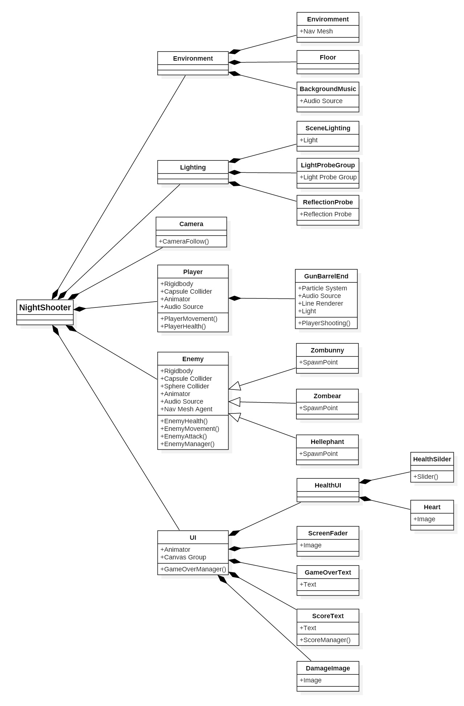
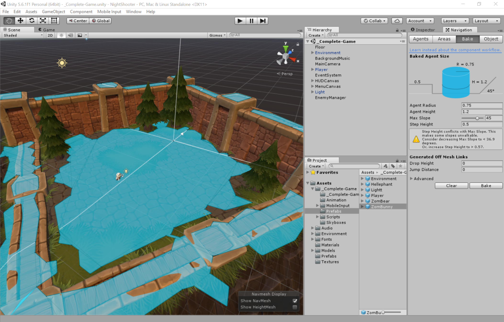
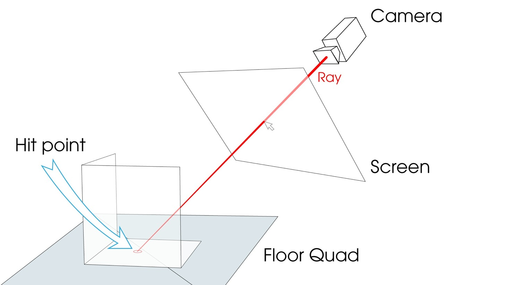
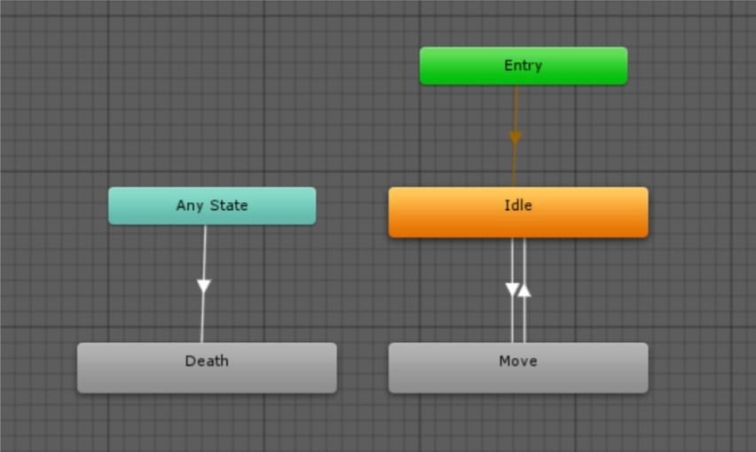
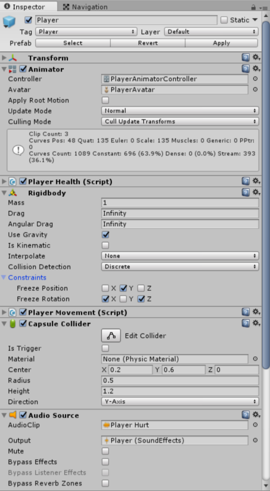
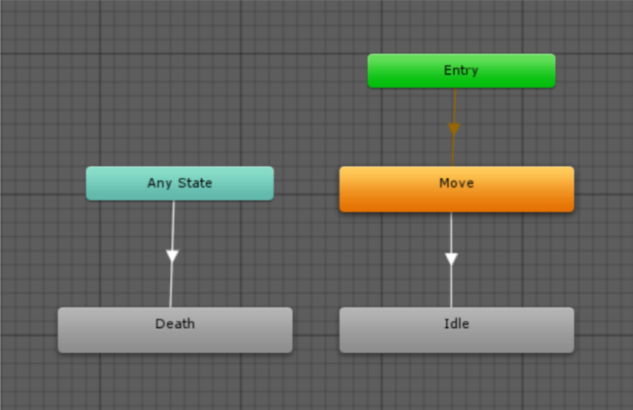
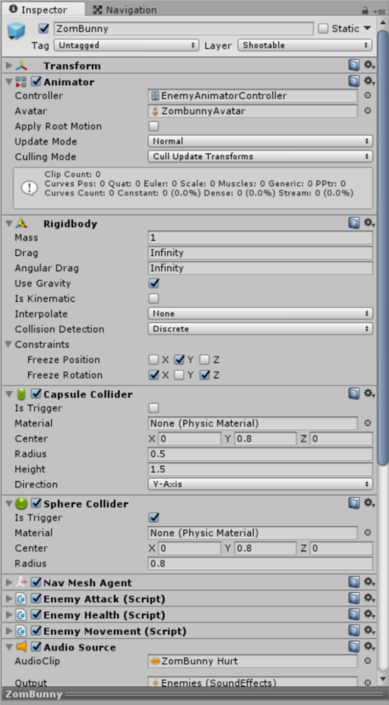

# 游戏说明

[TOC]

## 故事背景

这是利用Unity3D 5.6开发的一个俯瞰视图等距（isometric）视角的射击游戏，游戏的主人公小男孩在自己的房间中睡觉时，梦见他的玩具们都成了坏人来攻击他，而他也有了一把镭射枪，通过向玩具们射击来得分，当小男孩的生命值减到0时，游戏结束。

## 游戏控制

游戏通过键盘的`W` `S` `A` `D` 键或上下左右方向键控制主人公移动，鼠标移动控制主人公的朝向，主人公始终朝向鼠标指向的位置，鼠标左键或左`Ctrl` 键为开火键，主人公向前放放出镭射激光。

## 游戏设定

游戏开始玩家的生命值以状态条的形式现实在窗口左下方，被敌人攻击生命值就会下降，当被敌人攻击10次后，玩家生命值减为0，游戏结束。

游戏中共有两种小怪和一种大怪，小怪每6秒从4个产生点随机产生两个，大怪每15秒从1个产生点产生1个，小怪被镭射激光击中2次后死亡，大怪被击中5次后死亡。怪物一旦产生后就不断沿最短路向玩家移动，与玩家接触后就会对玩家产生伤害，直到被消灭或者玩家生命值减为0游戏结束。

# 开发过程

## 游戏对象

游戏中有一个场景（scene），场景中的游戏对象（Game Object）可大致分为6类，环境（Environment），灯光（Light），镜头（Camera），玩家（Player），敌人（Enemy），用户界面（UI），如下图所示。下面分别对其作简要描述。

 

### 环境

环境中的主体为整个游戏场景的3D模型，在整个模型上建立了为敌人角色自动寻找玩家的导航系统Navigation Mesh。

为了检测鼠标是否指向游戏场景以使玩家转向，在场景的最下方放置了一个不可见的正方形（Quad）作为反射层，每一帧渲染时，从镜头中心到鼠标位置发射一条射线，当射线落在反射层上时，认为是有效指向，玩家转向，否则认为是无效指向，玩家不转向。

背景音乐对象负责背景音乐的播放，设置为开始时播放（Play on awake）和循环播放（Loop）。

### 灯光

灯光由三部分组成，场景主光线（SceneLighting），装饰灯泡组（LightProbeGroup）和反射面（ReflectionProbe）组成。

### 镜头

镜头设置为在玩家后上方，向下俯瞰，正交投影模式。并时刻通过脚本使其时刻与玩家的相对位置保持不变，在后面的脚本控制部分具体阐述。

### 玩家

玩家对象有多个组件。

- 动画控制器控制玩家的动画状态,使其在等待（Idle），移动（Move）和死亡（Death）之间切换。默认状态时等待。
  
- 刚体（Rigidbody）组件使其能与游戏场景发生碰撞，使其能绕开障碍，在位置上锁定Y轴，使其不能发生上下偏离，旋转锁定X轴和Z轴，使其只能在竖直方向绕Y轴转向。加入碰撞器（Collider）用于判断是否与敌人相遇。还加上了被攻击时的音效，在收到敌人攻击时触发播放。控制脚本在后面介绍。

### 敌人

设定了两种小怪，蓝色的Zombunny和紫红色的Zombear，一种大怪，黄色的Hellephant。三种敌人的设定基本相同。

- 动画控制器控制怪物在运动（Move），等待（Idle）和死亡（Death）之间切换。默认状态是运动。
  
- 刚体组件和胶囊碰撞器使其能避开障碍物。位置锁定Y轴，旋转锁定X轴和Z轴。球形碰撞器设为触发器（Trigger），使其判断与玩家接触。 

### 用户界面

## 脚本控制