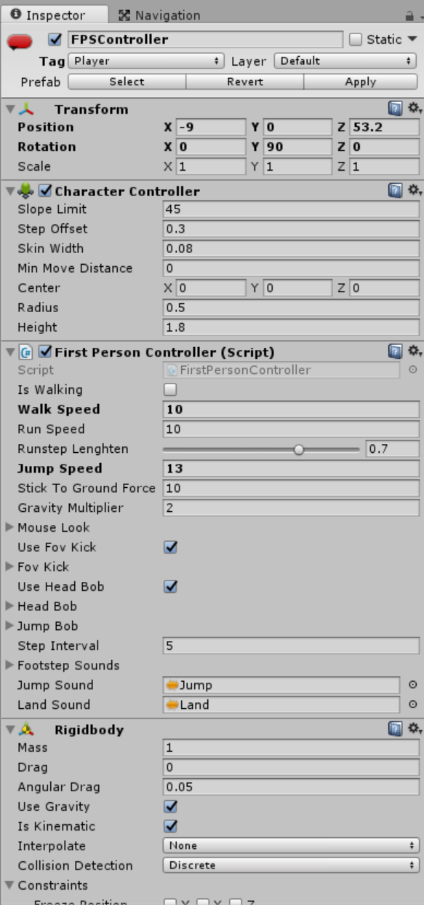

# 游戏说明

[TOC]

## 故事背景

这是利用Unity3D 5.6开发的一个俯瞰视图等距（isometric）视角的射击游戏，游戏的主人公小男孩在自己的房间中睡觉时，梦见他的玩具们都成了坏人来攻击他，而他也有了一把镭射枪，通过向玩具们射击来得分，当小男孩的生命值减到0时，游戏结束。

## 游戏控制

游戏通过键盘的`W` `S` `A` `D` 键或上下左右方向键控制主人公移动，鼠标移动控制主人公的朝向，主人公始终朝向鼠标指向的位置，鼠标左键或左`Ctrl` 键为开火键，主人公向前放放出镭射激光。

## 游戏设定

游戏开始玩家的生命值以状态条的形式现实在窗口左下方，被敌人攻击生命值就会下降，当被敌人攻击10次后，玩家生命值减为0，游戏结束。

游戏中共有两种小怪和一种大怪，小怪每6秒从4个产生点随机产生两个，大怪每15秒从1个产生点产生1个，小怪被镭射激光击中2次后死亡，大怪被击中5次后死亡。怪物一旦产生后就不断沿最短路向玩家移动，与玩家接触后就会对玩家产生伤害，直到被消灭或者玩家生命值减为0游戏结束。

# 开发过程

## 游戏对象

游戏中有一个场景（scene），场景中的游戏对象（Game Object）可大致分为6类，环境（Environment），灯光（Light），镜头（Camera），玩家（Player），敌人（Enemy），用户界面（UI），如下图所示。下面分别对其作简要描述。

 

### 环境

环境中的主体为整个游戏场景的3D模型，在整个模型上建立了为敌人角色自动寻找玩家的导航系统Navigation Mesh。


为了检测鼠标是否指向游戏场景以使玩家转向，在场景的最下方放置了一个不可见的正方形（Quad）作为反射层，每一帧渲染时，从镜头中心到鼠标位置发射一条射线，当射线落在反射层上时，认为是有效指向，玩家转向，否则认为是无效指向，玩家不转向。

背景音乐对象负责背景音乐的播放，设置为开始时播放（Play on awake）和循环播放（Loop）。

### 灯光

灯光由三部分组成，场景主光线（SceneLighting），装饰灯泡组（LightProbeGroup）和反射面（ReflectionProbe）组成。

### 镜头

镜头设置为在玩家后上方，向下俯瞰，正交投影模式。并时刻通过脚本使其时刻与玩家的相对位置保持不变，在后面的脚本控制部分具体阐述。

### 玩家

玩家对象有多个组件。

- 动画控制器控制玩家的动画状态,使其在等待（Idle），移动（Move）和死亡（Death）之间切换。默认状态时等待。
  
- 刚体（Rigidbody）组件使其能与游戏场景发生碰撞，使其能绕开障碍，在位置上锁定Y轴，使其不能发生上下偏离，旋转锁定X轴和Z轴，使其只能在竖直方向绕Y轴转向。加入碰撞器（Collider）用于判断是否与敌人相遇。还加上了被攻击时的音效，在收到敌人攻击时触发播放。控制脚本在后面介绍。



### 敌人

设定了两种小怪，蓝色的Zombunny和紫红色的Zombear，一种大怪，黄色的Hellephant。三种敌人的设定基本相同。

- 动画控制器控制怪物在运动（Move），等待（Idle）和死亡（Death）之间切换。默认状态是运动。
  
- 刚体组件和胶囊碰撞器使其能避开障碍物。位置锁定Y轴，旋转锁定X轴和Z轴。球形碰撞器设为触发器（Trigger），使其判断与玩家接触。 


### 用户界面

UI由如下及部分组成，左下方表示玩家生命值的部分，由一个心形图片和和一个滑动条构成，滑动条去掉了用户可以操作的按钮，仅作显示用；一个红色图片，正常情况下透明度为0，当玩家被攻击时动态改变透明度，以表示受伤效果；窗口上方的得分，通过脚本动态控制；游戏结束Game Over文字，在游戏结束时显示。其中Game Over部分时自己制作的一段动画剪辑。


## 脚本控制


### 玩家移动

获取水平垂直方向的输入，然后改变玩家的位置。

```c#
void FixedUpdate ()
{
      float h = Input.GetAxisRaw("Horizontal");
      float v = Input.GetAxisRaw("Vertical");
      Move (h, v);
      Turning ();
      Animating (h, v);
}
void Move (float h, float v)
{
    movement.Set (h, 0f, v);
    movement = movement.normalized * speed * Time.deltaTime;
    playerRigidbody.MovePosition (transform.position + movement);
}
```

### 玩家转向

从镜头视点到鼠标位置连一条射线`camRay`，如果打在Floor上，就调整玩家方向。

```c#
void Turning ()
{
    Ray camRay = Camera.main.ScreenPointToRay (Input.mousePosition);
    RaycastHit floorHit;
    if(Physics.Raycast (camRay, out floorHit, camRayLength, floorMask))
    {
        Vector3 playerToMouse = floorHit.point - transform.position;
        playerToMouse.y = 0f;
        Quaternion newRotatation = Quaternion.LookRotation (playerToMouse);
        playerRigidbody.MoveRotation (newRotatation);
    }
}
```

### 镜头跟踪

开始时获得镜头与玩家的相对位置，存储在向量`offset`中，然后时刻更新镜头的位置。

```c#
Vector3 offset;
void Start ()
{
    offset = transform.position - target.position;
}
void FixedUpdate ()
{
    Vector3 targetCamPos = target.position + offset;
    transform.position = Vector3.Lerp (transform.position, targetCamPos, smoothing * Time.deltaTime);
}
```

### 玩家射击

`timeBetweenBullets`表示射击的最小时间间隔，默认为0.15秒。当玩家按下射击键并且时间大于开火间隔时，调用射击函数。

```c#
void Update ()
{
    timer += Time.deltaTime;
    if(Input.GetButton ("Fire1") && timer >= timeBetweenBullets && Time.timeScale != 0)
    {
        Shoot ();
    }
    if(timer >= timeBetweenBullets * effectsDisplayTime)
    {
        DisableEffects ();
    }
}

```

射击函数首先是一系列效果的启用，然后从枪口到鼠标位置发出一条射线，判断是否击中怪物，击中的话就调用怪物的`TakeDamage`函数。需要注意的是，无论是否击中，射击的效果都要开启。

```c#
void Shoot ()
{
    timer = 0f;
    gunAudio.Play ();
    gunLight.enabled = true;
    faceLight.enabled = true;
    gunParticles.Stop ();
    gunParticles.Play ();
    gunLine.enabled = true;
    gunLine.SetPosition (0, transform.position);
    shootRay.origin = transform.position;
    shootRay.direction = transform.forward;
    if(Physics.Raycast (shootRay, out shootHit, range, shootableMask))
    {
        EnemyHealth enemyHealth = shootHit.collider.GetComponent <EnemyHealth> ();
        if(enemyHealth != null)
        {
            enemyHealth.TakeDamage (damagePerShot, shootHit.point);
        }
        gunLine.SetPosition (1, shootHit.point);
    }
    else
    {
        gunLine.SetPosition (1, shootRay.origin + shootRay.direction * range);
    }
}
```

### 敌人生命

玩家发出的射线击中怪物后，会调用其`TakeDamage()`函数，故此函数设为共有`public`。`TakeDamage()`函数中减少怪物的生命值`currentHealth`，并判断生命值是否减为0，如果生命值减为0，调用死亡函数`Death()`，`Death()`中播放怪物死亡的动画，同时调用`StartShinking()`函数使其慢慢沉降到地面下方，最后对其销毁。

```c#
void Update ()
{
    if(isSinking)
    {
        transform.Translate (-Vector3.up * sinkSpeed * Time.deltaTime);
    }
}
public void TakeDamage (int amount, Vector3 hitPoint)
{
    if(isDead)
        return;
    enemyAudio.Play ();
    currentHealth -= amount;

    hitParticles.transform.position = hitPoint;
    hitParticles.Play();
    if(currentHealth <= 0)
    {
        Death ();
    }
}
void Death ()
{
    isDead = true;
    capsuleCollider.isTrigger = true;
    anim.SetTrigger ("Dead");
    enemyAudio.clip = deathClip;
    enemyAudio.Play ();
}
public void StartSinking ()
{
    GetComponent <UnityEngine.AI.NavMeshAgent> ().enabled = false;
    GetComponent <Rigidbody> ().isKinematic = true;
    isSinking = true;
    ScoreManager.score += scoreValue;
    Destroy (gameObject, 2f);
}
```

### 敌人产生

对每一种怪物而言，设置一个产生间隔`spawnTime`，游戏中设置的小怪的间隔时6秒，大怪的间隔是15秒。设置一个位置数组`Transform[]`，用来存储怪物的产生点，游戏中每一种小怪有两个产生点，大怪有一个产生点。`InvokeRepeating()`函数设置周期性地调用`Span()`函数，每次从产生点数组中随机选择一个位置，用`Instantiate()`函数初始化一个怪物实例。

```c#
public class EnemyManager : MonoBehaviour
{
    public PlayerHealth playerHealth;
    public GameObject enemy;
    public float spawnTime = 6f;
    public Transform[] spawnPoints;
    void Start ()
    {
        InvokeRepeating ("Spawn", spawnTime, spawnTime);
    }
    void Spawn ()
    {
        if(playerHealth.currentHealth <= 0f)
        {
            return;
        }
        int spawnPointIndex = Random.Range (0, spawnPoints.Length);
        Instantiate (enemy, spawnPoints[spawnPointIndex].position, spawnPoints[spawnPointIndex].rotation);
    }
}
```

### 敌人移动

移动的前提是怪物自己和玩家都没有死亡，如果条件满足，利用导航模块，使怪物向玩家移动。

```c#
void Update ()
{
    if(enemyHealth.currentHealth > 0 && playerHealth.currentHealth > 0)
    {
        nav.SetDestination (player.position);
    }
    else
    {
        nav.enabled = false;
    }
}
```

### 敌人攻击

一旦玩家进入了某个怪物的攻击范围，即触发了某个怪物的碰撞触发器，就将bool变量`playerInRange`设为`true`以作标记。一旦玩家在攻击范围内，攻击时间大于攻击间隔且怪物的生命值不为0，当这几个条件同时满足时，怪物对玩家进行攻击，减少玩家的生命值，一旦玩家的生命值减小到0，调用玩家的死亡函数，并播放有些结束动画，游戏结束。

```c#
void OnTriggerEnter (Collider other)
{
    if(other.gameObject == player)
    {
        playerInRange = true;
    }
}
void Update ()
{
    timer += Time.deltaTime;
    if(timer >= timeBetweenAttacks && playerInRange && enemyHealth.currentHealth > 0)
    {
        Attack ();
    }
    if(playerHealth.currentHealth <= 0)
    {
        anim.SetTrigger ("PlayerDead");
    }
}
void Attack ()
{
    timer = 0f;
    if(playerHealth.currentHealth > 0)
    {
        playerHealth.TakeDamage (attackDamage);
    }
}
```

### 玩家生命

同样，玩家的`TakeDamage()`函数设为`public`供怪物调用。一旦玩家被攻击，`damage`变量被标记为`true`，屏幕播放受伤的红色效果，生命值下降。

```c#
void Update ()
{
    if(damaged)
    {
        damageImage.color = flashColour;
    }
    else
    {
        damageImage.color = Color.Lerp (damageImage.color, Color.clear, flashSpeed * Time.deltaTime);
    }
    damaged = false;
}
public void TakeDamage (int amount)
{
    damaged = true;
    currentHealth -= amount;
    healthSlider.value = currentHealth;
    playerAudio.Play ();
    if(currentHealth <= 0 && !isDead)
    {
        Death ();
    }
}
```

# 尾声

鉴于时间的仓促和人水平有限，在制作过程中有很多错误和不完美的地方，希望老师见谅，多多提出批评意见。这个小游戏主体上参照了Unity的一个视频教程，否则我自己不能找到如何漂亮得体的模型和如此细致的设计。但在学习过程中，对图形学有了更多的体会，老师课上讲的很多概念，看似非常底层，但在实际制作这个游戏的时候有跟多体现，如果没有老师耐心细致的讲解，我是不能在这么短的时间内学会并制作出这样一个Unity项目的，在这里向我的图形学老师表示感谢。


